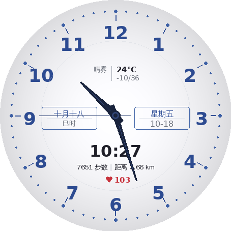

# 翰墨精英 - 华为表盘开发文档

## 目录

1. [效果预览](#1-效果预览)
2. [设计说明](#2-设计说明)
3. [技术架构](#3-技术架构)
4. [配置文件详解](#4-配置文件详解)
5. [图片资源规范](#5-图片资源规范)
6. [开发环境搭建](#6-开发环境搭建)
7. [构建与打包](#7-构建与打包)
8. [本地测试](#8-本地测试)
9. [发布到华为表盘市场](#9-发布到华为表盘市场)
10. [常见问题](#10-常见问题)

---

## 1. 效果预览

### 表盘效果图



### 效果图说明

表盘整体采用**蓝白商务风格**设计，主要视觉元素包括：

**表盘底色**
- 白银径向渐变：中心纯白，边缘渐变至浅银灰色
- 整体呈现出高级金属质感

**时标与刻度**
- 蓝色阿拉伯数字 1-12，无衬线粗体，清晰大方
- 蓝色小圆点分钟刻度环（60个圆点）
- 整点位置：加大蓝色圆点 + 向内蓝色短刻度线
- 淡灰色细内圈装饰环

**天气区域 (12点下方)**
- 天气描述文字（左） + 竖线分隔 + 温度/温度范围（右）

**信息面板 (中部左右)**
- 左面板：农历日期 / 时辰，蓝色细边框圆角矩形
- 右面板：星期 / 月-日，蓝色细边框圆角矩形
- 面板内上下用细线分隔

**数据区 (下部)**
- 数字时间 HH:MM 粗体居中
- 步数 | 距离（竖线分隔）
- 心率（红色心形图标 + 数值）

**指针系统**
- 时针：深蓝宽锥形，带蓝色高光中线，有尾部
- 分针：深蓝窄锥形，带蓝色高光中线
- 秒针：蓝色极细针
- 中心：深蓝三层金属质感装饰帽

---

## 2. 设计说明

### 2.1 设计灵感

本表盘设计灵感来源于经典蓝白商务腕表：
- 蓝色与白银的冷峻商务配色
- 蓝色圆点刻度环的精致细节
- 对称平衡的双面板信息布局
- 深蓝锥形指针的金属质感

### 2.2 色彩方案

| 颜色名称 | 色值 | 用途 |
|---------|------|------|
| 白色渐变 | #FFFFFF → #DCE0E6 | 表盘底色（中心→边缘） |
| 数字蓝 | #2D4B91 | 阿拉伯数字 |
| 圆点蓝 | #3C5FA5 | 分钟刻度圆点 |
| 刻度蓝 | #325096 | 整点刻度线 |
| 边框蓝 | #466AAA | 面板边框 |
| 文字蓝 | #37559B | 面板内文字 |
| 指针深蓝 | #19233C | 时针/分针 |
| 指针高光 | #324678 | 指针中线高光 |
| 深色文字 | #1E1E28 | 数字时间、数据 |
| 灰色文字 | #6E737D | 辅助信息 |
| 心率红 | #C8323C | 心率图标和数值 |
| 红色 | #D4374A | 心率数据 |
| 绿色 | #4A9B5A | 电池数据 |

### 2.3 字体规范

- 阿拉伯数字：DejaVu Sans Bold，36px，蓝色
- 数字时间：DejaVu Sans Bold，32px，深色
- 面板中文：文泉驿正黑 / Noto Sans CJK，15px，蓝色
- 数据文字：13-16px，深色/灰色

### 2.4 设计特色

本表盘采用蓝白商务风格，与参考设计保持一致的设计语言：

1. **蓝色圆点刻度环**：精致的分钟圆点标记
2. **白银渐变底色**：中心白→边缘银灰的径向渐变
3. **双面板对称布局**：农历/时辰（左）+ 星期/日期（右）
4. **天气信息区**：天气文字 | 温度/范围，带竖线分隔
5. **紧凑数据行**：步数 | 距离 + 心率
6. **深蓝锥形指针**：带蓝色高光中线的金属质感

---

## 3. 技术架构

### 3.1 华为表盘文件结构

华为 GT 系列表盘使用 `.hwt` 格式，本质是 ZIP 压缩包，内部结构如下：

```
Elite_Business.hwt (ZIP)
├── description.xml           ← 表盘元数据 (名称/版本/分辨率)
├── preview/
│   ├── cover.jpg             ← 表盘市场预览大图
│   └── icon_small.jpg        ← 列表缩略图
└── watchface/
    ├── watch_face_config.xml ← 核心配置 (控件定义)
    ├── watch_face_info.xml   ← 版本信息
    └── res/                  ← 图片资源
        ├── background/       ← 背景图层 (5张)
        ├── hands/            ← 指针图片 (3张)
        ├── icons/            ← 功能图标 (6张)
        │   └── week/         ← 星期文字 (7张)
        └── weather/          ← 天气图标 (8张)
```

### 3.2 控件类型说明

本表盘使用了以下 7 种华为表盘控件：

| 控件类型 | 中文名 | 本项目使用场景 |
|---------|--------|--------------|
| IMAGE | 单图 | 背景、图标、分隔符 |
| TEXTUREMAPPER | 指针旋转 | 时针、分针、秒针 |
| SELECTIMAGE | 选图 | 天气图标、星期显示 |
| TEXTAREAWITHONEWILDCARD | 单变量文本 | 温度、步数、心率等 |
| TEXTAREAWITHTWOWILDCARD | 双变量文本 | 日期(月/日)、时间(时:分)、电量 |
| BOX | 背景框 | 日期面板背景 |
| CIRCLE | 弧形进度 | 步数进度弧 |

### 3.3 数据类型 (data_type)

| 数据类型 | 说明 |
|---------|------|
| DATA_HOUR_PRICKER | 时针角度 |
| DATA_MIN_PRICKER | 分针角度 |
| DATA_SEC_PRICKER | 秒针角度 |
| DATA_HOUR | 小时数字 |
| DATA_MIN | 分钟数字 |
| DATA_MONTH | 月份 |
| DATA_DAY | 日期 |
| DATA_WEEK | 星期 |
| DATA_LUNAR | 农历日期 |
| DATA_CHINESE_HOUR | 时辰 |
| DATA_WEATHER | 天气类型 (切换图片) |
| DATA_WEATHER_TEXT | 天气文字描述 |
| DATA_TEMPERATURE | 温度 |
| DATA_STEP | 步数 |
| DATA_STEP_PROGRESS | 步数目标进度 |
| DATA_CALORIE | 卡路里 |
| DATA_DISTANCE | 距离 |
| DATA_HEART_RATE | 心率 |
| DATA_BATTERY | 电池电量 |
| DATA_NULL | 空 (占位) |

### 3.4 连接符类型 (connector)

| 连接符 | 显示效果 | 使用场景 |
|--------|---------|---------|
| CONN_COLON | XX:XX | 时间显示 |
| CONN_DASH | XX-XX | 日期显示 |
| CONN_PERCENT | XX% | 电量显示 |

---

## 4. 配置文件详解

### 4.1 description.xml

描述文件定义表盘的基本元数据信息：

```xml
<?xml version="1.0" encoding="utf-8"?>
<HwTheme>
    <title>Elite_Business</title>          <!-- 英文名 (不可修改) -->
    <title_cn>翰墨精英</title_cn>           <!-- 中文名 (不可修改) -->
    <developer>Etherealsdu</developer>     <!-- 开发者名 (不可修改) -->
    <designer>Etherealsdu</designer>       <!-- 设计师名 (不可修改) -->
    <boardname>HWHD02</boardname>          <!-- 设备代号 -->
    <screen>
        <resolution width="454" height="454" />  <!-- 分辨率 -->
    </screen>
</HwTheme>
```

**设备代号对照表:**

| 代号 | 分辨率 | 适配设备 |
|------|--------|---------|
| HWHD01 | 390x390 | 荣耀手表、GT雅致款 |
| HWHD02 | 454x454 | WATCH GT全系列 (运动/活力) |

> **注意**: `title`、`title_cn`、`developer`、`designer` 四项在表盘上线后**不可修改**，请提前确定好。

### 4.2 watch_face_config.xml

这是表盘的核心配置文件，定义所有控件的类型、位置、数据绑定。

**根节点:**
```xml
<WatchFace dpi="454">
    <!-- 所有 Widget 按图层顺序排列，前面的在底层 -->
</WatchFace>
```

**静态图片控件示例:**
```xml
<Widget widget_type="IMAGE">
    <Image label="background" type="static"
        x="0" y="0" w="454" h="454"
        res_id="background/bg_main.png" />
</Widget>
```

**指针控件示例:**
```xml
<Widget widget_type="TEXTUREMAPPER">
    <TextureMapper label="hour_hand" type="dynamic"
        data_type="DATA_HOUR_PRICKER"
        center_x="227" center_y="227"       <!-- 表盘旋转中心 -->
        pivot_x="14" pivot_y="115"           <!-- 图片旋转锚点 -->
        start_angle="0" end_angle="360"
        res_id="hands/hour_hand.png" />
</Widget>
```

**动态文本控件示例:**
```xml
<Widget widget_type="TEXTAREAWITHONEWILDCARD">
    <TextAreaWithOneWildcard label="step_count" type="dynamic"
        data_type="DATA_STEP"
        x="128" y="340" w="70" h="20"
        font_size="16" font_color="#1A1A2E"
        align="left" />
</Widget>
```

**选图控件示例:**
```xml
<Widget widget_type="SELECTIMAGE">
    <SelectImage label="weather_icon" type="dynamic"
        data_type="DATA_WEATHER"
        x="165" y="118" w="40" h="40"
        res_dir="weather/" />
    <!-- weather/ 目录下的图片按序号命名: 0.png, 1.png, ... -->
</Widget>
```

### 4.3 watch_face_info.xml

```xml
<?xml version="1.0" encoding="utf-8"?>
<WatchFaceInfo>
    <version>1.0.0</version>
    <build>1</build>
    <name>Elite_Business</name>
    <type>analog</type>
    <aod_support>true</aod_support>
</WatchFaceInfo>
```

---

## 5. 图片资源规范

### 5.1 通用要求

- 格式：PNG (支持透明通道)
- 色彩空间：RGBA
- 坐标系：左上角为原点 (0, 0)
- 背景层图片尺寸必须为 454x454
- 总包大小不超过 5MB

### 5.2 资源文件清单

| 文件路径 | 尺寸 | 说明 |
|---------|------|------|
| `background/bg_main.png` | 454x454 | 白银渐变背景 |
| `background/tick_ring.png` | 454x454 | 蓝色圆点+刻度环 |
| `background/numerals.png` | 454x454 | 蓝色阿拉伯数字 1-12 |
| `background/inner_ring.png` | 454x454 | 内圈装饰环 |
| `background/center_cap.png` | 20x20 | 深蓝中心装饰帽 |
| `hands/hour_hand.png` | 28x130 | 时针（深蓝锥形） |
| `hands/minute_hand.png` | 20x170 | 分针（深蓝锥形） |
| `hands/second_hand.png` | 8x195 | 秒针（蓝色极细） |
| `icons/ic_heart.png` | 16x16 | 心率图标（红色） |
| `icons/separator.png` | 2x20 | 数据分隔线 |
| `icons/week/1~7.png` | 50x20 | 星期一~日（蓝色） |
| `weather/0~7.png` | 32x32 | 天气图标 (8种) |

### 5.3 指针设计要点

指针图片的旋转锚点 (`pivot_x`, `pivot_y`) 决定了指针围绕哪个点旋转：
- 指针图片**竖直放置**，尖端朝上，锚点在旋转中心位置
- `pivot_x` = 图片中心 X 坐标
- `pivot_y` = 从图片顶部到旋转中心的距离

```
时针 (28x130):  pivot_x=14, pivot_y=100  → 尖端长度 100px，尾部 30px
分针 (20x170):  pivot_x=10, pivot_y=140  → 尖端长度 140px，尾部 30px
秒针 (8x195):   pivot_x=4,  pivot_y=160  → 尖端长度 160px，尾部 35px
```

---

## 6. 开发环境搭建

### 6.1 方式一: 命令行开发 (本项目使用)

适合程序化生成资源、版本控制、自动化流程。

**环境要求:**
```bash
# Python 3.6+
python3 --version

# 安装 Pillow 图片处理库
pip install Pillow

# zip 命令 (打包用)
zip --version
```

**开发流程:**
1. 修改 `tools/generate_assets.py` 中的设计参数
2. 运行 `python3 tools/generate_assets.py` 重新生成资源
3. 修改 `watchface/watchface/watch_face_config.xml` 配置控件
4. 运行 `bash tools/package.sh` 打包

### 6.2 方式二: 华为官方 Theme Studio

适合可视化拖拽设计、不需要编码。

**下载与安装:**
1. 访问 [华为开发者联盟 - 设计工具下载](https://developer.huawei.com/consumer/cn/doc/distribution/content/themes-design-tools-0000001054531194)
2. 下载 **Huawei WatchFace Designer** (Theme Studio)
3. 安装并运行
4. 选择 **文件 > 新建** > 选择 GT 系列 > 454x454 分辨率

**使用 Theme Studio 打开本项目:**
1. 选择 **文件 > 打开**
2. 定位到 `watchface/description.xml`
3. Theme Studio 会加载整个表盘工程

### 6.3 方式三: 在线设计 (Theme Studio Pro)

华为提供了在线版工具：
- 地址: https://themestudio.cloud.huawei.com/
- 无需安装软件
- 功能与桌面版基本一致

---

## 7. 构建与打包

### 7.1 资源生成

```bash
# 从项目根目录运行
python3 tools/generate_assets.py
```

脚本会在 `watchface/watchface/res/` 目录下生成所有图片资源，在 `watchface/preview/` 下生成预览图。

### 7.2 打包为 .hwt

```bash
bash tools/package.sh
```

输出文件：
- `output/Elite_Business.hwt` — 最终表盘安装包
- `output/com.huawei.watchface` — 中间打包文件

### 7.3 打包要求

- HWT 总大小不超过 **5MB**
- bin 文件不超过 **1.4MB**
- 文件名**不能包含中文**，只允许字母、数字、下划线
- 预览图格式必须为 **JPG**

### 7.4 手动打包 (不使用脚本)

如果无法运行脚本，可以手动打包：

```bash
cd watchface/
zip -r ../output/Elite_Business.hwt \
    description.xml \
    preview/ \
    watchface/
```

或使用华为官方打包工具 `TemplateWatch.exe`：
1. 将 `watchface/` 文件夹拖放到 `TemplateWatch.exe` 上
2. 自动生成 `com.huawei.watchface` 和 `output/` 目录

---

## 8. 本地测试

### 8.1 手机端测试

1. 将 `.hwt` 文件传输到手机 (微信/蓝牙/USB)
2. 使用**华为运动健康** APP 打开文件
3. 确保手机与手表已配对连接
4. 按提示安装到手表

**注意:** 测试安装需要使用华为开发者账号登录运动健康 APP。

### 8.2 预览测试

在浏览器中打开 `docs/preview.html` 可查看表盘在模拟手表外壳中的效果。

### 8.3 常见测试问题

| 问题 | 原因 | 解决方案 |
|------|------|---------|
| 安装失败 | 分辨率不匹配 | 检查 description.xml 中的 boardname |
| 图片不显示 | 路径错误 | 检查 res_id 路径与实际文件对应 |
| 指针位置偏 | pivot 设置错误 | 调整 pivot_x/pivot_y 和 center_x/center_y |
| 数据不更新 | data_type 错误 | 核对数据类型名称拼写 |
| 包太大 | 图片未优化 | 压缩 PNG 尺寸或降低质量 |

---

## 9. 发布到华为表盘市场

### 9.1 前置条件

1. **注册华为开发者账号**
   - 访问 [华为开发者联盟](https://developer.huawei.com/consumer/cn/)
   - 完成实名认证
   - 签署主题开发者协议

2. **准备发布材料**
   - 表盘 .hwt 安装包
   - 表盘预览截图 (至少2张，JPG格式)
   - 表盘描述文本
   - 分类标签

### 9.2 发布步骤

#### 第一步: 登录开发者后台

1. 访问 [华为主题开发者后台](https://developer.huawei.com/consumer/cn/theme/)
2. 使用开发者账号登录
3. 进入 **我的主题** > **表盘管理**

#### 第二步: 创建新表盘

1. 点击 **创建表盘**
2. 填写基本信息：
   - 表盘名称: `翰墨精英`
   - 英文名称: `Elite Business`
   - 分类: `商务` / `经典`
   - 支持设备: 勾选对应的 GT 系列型号
3. 上传表盘文件 (`.hwt`)

#### 第三步: 上传素材

1. 上传**表盘预览图** (cover.jpg)
   - 建议尺寸: 800x800 或更高
   - 格式: JPG / PNG
2. 上传**手表实机效果图** (可选)
3. 填写**表盘描述**:

```
翰墨精英 — 经典商务风格表盘

设计特色：
• 罗马数字时标，衬线字体，庄重典雅
• 金色点缀搭配温润米白底色
• 公历/农历双面板对称布局
• 全面数据展示：天气、步数、卡路里、距离、心率、电量

适合追求经典与实用并重的商务人士。
```

#### 第四步: 设置定价

- **免费发布**: 直接提交
- **付费发布**: 设置价格 (需要完成银行账户绑定)

#### 第五步: 提交审核

1. 检查所有信息填写正确
2. 点击 **提交审核**
3. 等待华为审核团队审核 (通常 3-5 个工作日)

#### 第六步: 上线

- 审核通过后，表盘将在华为表盘市场上线
- 可在**华为运动健康 APP** > **表盘市场** 中搜索到

### 9.3 审核注意事项

- 表盘名称不能包含与华为品牌混淆的字样
- 预览图必须真实反映表盘效果，不能有误导
- 不能抄袭已有表盘设计
- 资源文件不能包含违规内容
- bin 文件 ≤ 1.4MB，HWT 总包 ≤ 5MB
- 所有文字需要清晰可读
- 指针必须正确指示时间

### 9.4 发布后管理

- 在开发者后台可查看下载量、评分等数据
- 如需更新版本，上传新的 `.hwt` 并递增 `version` 号
- 可随时下架或修改定价

---

## 10. 常见问题

### Q: 如何修改表盘颜色？

编辑 `tools/generate_assets.py` 中的颜色常量定义，然后重新运行资源生成和打包：

```python
GOLD = (201, 169, 110, 255)       # 修改金色
DARK_NAVY = (26, 26, 46, 255)     # 修改深色
OFF_WHITE = (248, 245, 240, 255)  # 修改底色
```

### Q: 如何增加/减少显示的数据？

在 `watch_face_config.xml` 中添加或删除对应的 `<Widget>` 节点。注意层叠顺序。

### Q: 如何适配 390x390 分辨率？

1. 修改 `description.xml` 中 `boardname` 为 `HWHD01`，分辨率为 390x390
2. 修改 `generate_assets.py` 中 `SIZE = 390`
3. 按比例调整 `watch_face_config.xml` 中所有坐标值 (乘以 390/454 ≈ 0.859)
4. 重新生成资源和打包

### Q: 如何添加自定义字体？

华为表盘对自定义字体的支持有限：
- `TEXTUREMAPPER` 控件支持自定义字体
- `TEXTAREAWITH*` 文本控件只能使用华为内嵌字体
- 如需特殊字体效果，建议将文字做成图片资源

### Q: 打包后文件超过 5MB 怎么办？

1. 使用 `optipng` 或 `pngquant` 压缩 PNG 图片
2. 减少不必要的图片资源
3. 降低图片分辨率 (在不影响显示效果的前提下)
4. 移除未使用的空目录

```bash
# 使用 pngquant 批量压缩
find watchface/watchface/res -name "*.png" -exec pngquant --force --output {} {} \;
```

### Q: 表盘安装到手表后显示异常？

1. 确认 `boardname` 与手表型号匹配
2. 检查所有图片文件是否完整
3. 确认 `watch_face_config.xml` 中的 `res_id` 路径正确
4. 使用 Theme Studio 打开工程验证

---

## 参考资料

- [华为表盘开发官方文档](https://developer.huawei.com/consumer/cn/doc/content/watch-face-introduction-0000001566918497)
- [华为 GT 系列表盘控件说明](https://developer.huawei.com/consumer/en/doc/distribution/content/gtwatch-widget-0000001096585895)
- [华为 GT 系列表盘设计规范](https://developer.huawei.com/consumer/en/doc/distribution/content/gtwatch-specification-0000001077917528)
- [华为 Codelab 表盘教程](https://developer.huawei.com/consumer/en/codelab/theme-Watchface/index.html)
- [Theme Studio 在线版](https://themestudio.cloud.huawei.com/)
- [华为开发工具下载](https://developer.huawei.com/consumer/cn/doc/distribution/content/themes-design-tools-0000001054531194)
